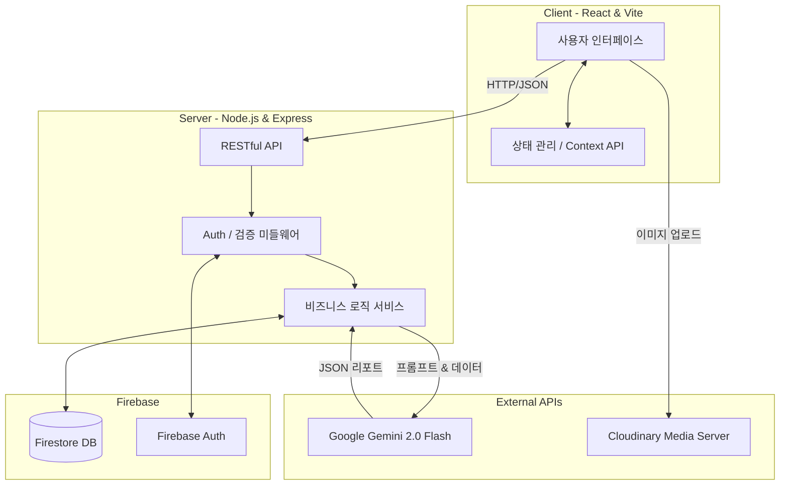
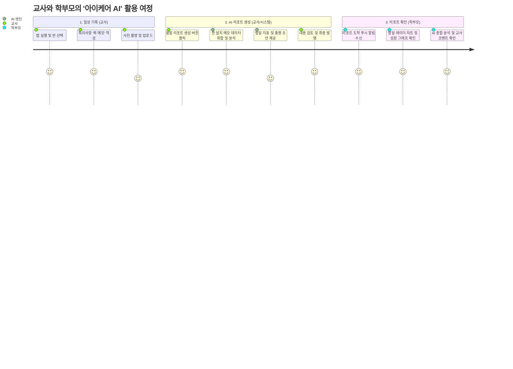

# 🏆 [KIT 바이브코딩 공모전] 👋 바이브가이즈

Live Demo : https://vibe-guys.vercel.app

API Docs : https://vibe-guys.onrender.com/docs

> **아이케어 AI (iCare AI) - 키즈노트**
> AI 기반 영유아 스마트 리포트 및 보육 행정 혁신 솔루션
> *"교사에게는 여유를, 부모에게는 확신을."*

---

## 📝 1. 프로젝트 개요

'아이케어 AI'는 어린이집 및 유치원 교사들의 과도한 행정 업무 부담을 줄이고, 학부모에게는 자녀의 발달 상황에 대한 투명하고 객관적인 지표를 제공하기 위해 기획된 **AI 기반 스마트 보육 플랫폼**입니다. 

파편화되어 있는 영유아의 일상 관찰 기록, 사진, 출결 데이터를 하나의 플랫폼으로 통합하며, 구글의 최신 **Gemini 2.0 Flash 모델**을 활용하여 단편적인 기록들을 종합적이고 전문적인 '월간 발달 리포트'로 자동 변환합니다.

---

## 🚀 2. 기획 배경 및 목적

### 🚨 2.1. 보육 현장의 Pain Points

1. **✍️ 과도한 수기 기록 부담:** 현행 보육 지침상 의무화된 관찰 일지 작성은 교사들의 방과 후 초과 근무의 주된 원인입니다. 교사 1인당 담당 아동 수가 많을수록 질 높은 기록을 남기기 어렵습니다.
2. **🗣️ 리포트의 주관성 및 비전문성:** 단순 텍스트 위주의 알림장은 교사의 당일 컨디션이나 주관에 크게 의존하며, 아동의 종합적인 '발달 지표'를 객관적으로 분석하여 전달하는 데에는 한계가 존재합니다.
3. **🗂️ 소통 및 데이터 채널의 파편화:** 출결 관리, 공지사항, 사진 공유, 관찰 기록이 각기 다른 앱이나 수기 장부로 분산되어 있어, 기관과 학부모 모두 데이터 관리에 피로감을 느낍니다.

### 🎯 2.2. 해결 방안 (Solution)

* **🤖 AI 기반 문서 자동화:** 일과 중 틈틈이 작성한 짧은 메모와 사진들을 AI가 취합하여, 월말에 전문가 수준의 발달 리포트(사회성, 신체발달, 인지능력 등)로 자동 생성합니다.
* **🔗 올인원(All-in-One) 통합 플랫폼:** 스마트 출결, 기관 공지, 캘린더 일정, 관찰 기록을 단일 서비스 내에서 완벽하게 제어합니다.
* **🤝 데이터 시각화를 통한 신뢰 구축:** AI가 분석한 영역별 점수를 방사형 차트(Radar Chart) 및 성장 그래프로 시각화하여, 학부모가 아이의 성장을 한눈에 파악할 수 있도록 돕습니다.

---

## 🔄 3. 시스템 아키텍처 및 데이터 흐름도

### 🏗️ 3.1. System Architecture



---

### 🏗️ 3.2. 핵심 기능 플로우 (AI 리포트 생성)

```sequenceDiagram
    actor Teacher as 👩‍🏫 교사
    participant App as 📱 아이케어 앱
    participant Server as 🖥️ Express 서버
    participant DB as 🗂️ Firestore
    participant AI as 🤖 Gemini API
    actor Parent as 👨‍👩‍👧 학부모

    Teacher->>App: 1. 일상 관찰 '퀵 메모' 작성 및 사진 업로드 (수시)
    App->>DB: 2. 메모 데이터 실시간 저장
    Teacher->>App: 3. 월말 'AI 리포트 생성' 버튼 클릭
    App->>Server: 4. 특정 아동의 한 달치 메모 데이터 요청
    Server->>DB: 5. 데이터 조회 및 필터링
    Server->>AI: 6. 취합된 데이터 + 분석 프롬프트 전송
    AI-->>Server: 7. 구조화된 JSON 형태의 분석 결과 반환
    Server->>DB: 8. 최종 리포트 데이터 저장
    Server-->>App: 9. 리포트 생성 완료 응답
    App->>Parent: 10. 리포트 발행 푸시 알림
    Parent->>App: 11. 시각화된 발달 그래프 및 총평 확인
```

---

## 👥 4. 타겟 사용자 및 유저 시나리오 (User Scenarios)

### 👤 4.1. 타겟 페르소나 (Target Persona)

| 구분 | 페르소나 | 주요 고민 (Pain Points) | 아이케어 AI를 통한 해결 (Needs) |
| :--- | :--- | :--- | :--- |
| **Primary** | **👩‍🏫 보육 교사 (20~40대)** | "아이들 돌보기도 바쁜데 관찰 일지와 알림장 작성 등 행정 업무가 너무 많아 야근이 잦아요." | 틈틈이 작성한 퀵 메모를 AI가 취합해 월말 리포트로 자동 생성하여 서류 작업 시간 대폭 단축. |
| **Secondary** | **👨‍👩‍👧 학부모 (30~40대)** | "우리 아이가 원에서 잘 지내는지, 또래에 비해 발달이 늦진 않은지 전문적인 피드백을 받고 싶어요." | 매일 수신되는 사진/출결 정보와 더불어, AI가 객관적 지표로 분석한 시각화된 발달 리포트 확인. |

### 🎬 4.2. 핵심 유저 여정 (User Journey Map)



---

## ⭐ 5. 주요 기능 상세 (Core Features)

본 프로젝트는 교사의 업무 편의성과 학부모의 정보 접근성을 동시에 충족하기 위해, 4가지 핵심 모듈로 기능을 구성했습니다.

### 🤖 5.1. AI 특화 기능 (AI-Powered)
* **스마트 발달 리포트 자동 생성:** * 파편화된 일상 관찰 메모(한 달 치)를 `Gemini 2.0 Flash` 모델이 취합 및 분석합니다.
  * 아동의 **5대 발달 영역(신체, 인지, 사회성, 정서, 언어)**을 1~100점 척도로 수치화하고, 전문가 수준의 서술형 종합 평가를 자동 작성합니다.
* **관심사 및 행동 키워드 추출:** * 수많은 기록 속에서 아이의 최근 관심사나 두드러지는 행동 패턴(예: "블록놀이", "양보", "규칙 준수")을 해시태그 형태로 추출하여 대시보드에 요약 제공합니다.

### 📝 5.2. 교사 편의 기능 (For Teacher)
* **현장 밀착형 '퀵 메모 (Quick Memo)':** * 바쁜 보육 현장에서 타이핑 시간을 최소화하기 위해 폼(Form)을 간소화했습니다. 아이 이름과 카테고리만 탭(Tap)하고 짧은 텍스트를 남기면 즉시 DB에 연동됩니다.
  * **미디어 업로드:** `Cloudinary` 미디어 서버와 연동하여, 고화질 활동 사진을 압축 및 최적화하여 빠르게 업로드합니다.
* **스마트 출결 및 행정 대시보드:** * 반별 전체 원아의 등/하원 상태를 직관적인 카드 UI로 한눈에 파악하고 제어할 수 있습니다. 결석 사유(병결, 가정학습 등)도 손쉽게 관리됩니다.

### 👨‍👩‍👧 5.3. 학부모 소통 기능 (For Parent)
* **성장 지표 시각화 (Data Visualization):** * AI가 도출한 발달 정량화 수치를 프론트엔드에서 `Radar Chart`(방사형 차트) 및 `Line Graph`로 렌더링하여, 아이의 강점과 보완점을 한눈에 보여줍니다.
* **통합 알림장 및 학사 일정 캘린더:** * 전체 공지사항, 주간 식단표, 원내 행사 일정을 캘린더 뷰 형태로 제공하여 학부모가 원내 소식을 누락 없이 모아볼 수 있습니다.

---

## 🛠️ 6. 기술 스택 및 구현 전략

본 프로젝트는 빠르고 안정적인 서비스 배포와 향후 스케일업을 고려하여, 타입 안정성이 높은 **TypeScript 에코시스템**을 기반으로 구축되었습니다.

### 💻 6.1. Tech Stack Overview

| 영역 | 기술 스택 | 도입 배경 및 목적 |
| :--- | :--- | :--- |
| **Frontend** |     | 강력한 컴포넌트 재사용성 및 `Vite`를 통한 빠른 빌드 환경 구축. `Tailwind`를 활용한 신속하고 일관된 UI 렌더링. |
| **Backend** |   | 비동기 처리 성능이 우수하며 프론트엔드와 동일한 언어(TypeScript) 사용으로 풀스택 개발 생산성 극대화. |
| **Database** |  | NoSQL 기반의 유연한 데이터 구조와 빠른 읽기/쓰기 지원. |
| **Auth** |  | 교사/학부모 역할(Role)에 따른 안전한 회원가입 및 권한 제어(RBAC) 구현. |
| **AI & Media**|  | 방대한 컨텍스트 창을 지원하는 초고속 AI 모델과, 이미지 최적화 서빙을 위한 전용 미디어 클라우드. |

---

## 🧠 7. AI 프롬프트 엔지니어링 및 데이터 파이프라인

단순한 '텍스트 생성'을 넘어, 프론트엔드에서 즉시 시각화할 수 있는 **정형화된 데이터(Structured JSON)를 일관되게 반환하도록 AI를 통제**하는 것이 본 서비스의 핵심 기술입니다.

### ⚙️ 7.1. 데이터 처리 파이프라인 흐름도

```mermaid
graph LR
    A[Raw Data<br>(한 달치 퀵 메모)] --> B[Express Server<br>데이터 전처리 및 필터링]
    B --> C{System Prompt 결합}
    C --> D[Gemini 2.0 Flash<br>추론 및 분석]
    D --> E[JSON Output<br>점수, 요약, 키워드]
    E --> F[Client<br>차트 렌더링 및 UI 출력]
    
    style C fill:#f9f,stroke:#333,stroke-width:2px
    style D fill:#8E75FF,stroke:#fff,stroke-width:2px,color:#fff
```

---

## 🗣️ 7.2. 시스템 프롬프트(System Prompt) 설계
```json
// 💡 [실제 AI API 호출 시나리오 예시]
{
  "system_instruction": {
    "role": "expert_educator",
    "persona": "당신은 10년 이상의 경력을 가진 유아 발달 전문가이자 다정한 보육 교사입니다.",
    "task": "제공된 [관찰 메모 배열]을 분석하여 아이의 발달 상태를 객관적으로 평가하세요.",
    "output_constraints": [
      "1. 반드시 아래 지정된 JSON 포맷으로만 응답할 것. Markdown 백틱(```)을 포함하지 말 것.",
      "2. 'scores' 객체의 신체, 인지, 사회성, 정서, 언어 영역은 관찰 빈도와 긍정도를 기반으로 1~100 사이 정수로 산출할 것.",
      "3. 'summary'는 학부모가 읽기 편안하고 따뜻한 경어체(~했습니다, ~보여요)를 사용할 것."
    ]
  }
}
```

---

## 🎁 8. 기대 효과 및 비즈니스 모델 (Impact & Business Scope)

### 📈 8.1. 프로젝트 기대 효과 (Core Value)

* **[사회적 가치] 보육 환경의 질적 개선:** 교사가 관찰 일지 및 알림장 작성 등 수기 행정 업무에 뺏기던 시간을 획기적으로 단축합니다. 이를 통해 아이들과 직접 눈을 맞추고 상호작용하는 **'본연의 보육 및 교육 시간'을 확보**하여 전반적인 보육 서비스의 질을 높입니다.
* **[운영 가치] 학부모-기관 간 투명한 신뢰 구축:** 단순한 텍스트 코멘트를 넘어, AI가 분석한 객관적이고 시각화된 발달 데이터(성장 그래프 등)를 정기적으로 제공함으로써 학부모의 불안감을 해소하고 기관에 대한 굳건한 신뢰를 형성합니다.
* **[기술적 가치] 비정형 데이터의 자산화:** 휘발되거나 버려지기 쉬운 짧은 텍스트 메모와 사진들을 AI 파이프라인을 통해 정형화된 발달 지표(JSON 및 DB 데이터)로 변환하여, 영유아의 체계적인 성장 데이터를 축적합니다.

### 🚀 8.2. 수익 모델 및 향후 확장성 (Future Scalability)

* **🛍️ 맞춤형 에듀테크 커머스 연계 (B2B / B2C 모델):**
  * AI 리포트 분석 결과를 바탕으로 타겟팅 추천을 진행합니다. 예를 들어 '소근육 발달'이나 '인지 능력' 보완이 필요한 아동에게 그에 맞는 맞춤형 교구재, 그림책, 몬테소리 놀이 프로그램 등을 추천하고 판매하는 커머스 제휴 모델로 확장할 수 있습니다.
* **👁️ 멀티모달(Multi-modal) 기반 정서 분석 고도화:**
  * 현재의 텍스트 기반(LLM) 분석을 넘어, 교사가 업로드한 활동 사진이나 영상 속 아이의 표정을 Vision AI 모델로 분석하여 그날의 '스트레스 지수'나 '행복도'를 도출해 리포트에 추가 반영합니다.
* **🏢 엔터프라이즈 보육 솔루션(SaaS) 제공:**
  * 단일 어린이집을 넘어 대형 프랜차이즈 유치원이나 국공립 기관을 대상으로, 통합 원아 관리 대시보드 및 기존 ERP 시스템 연동을 지원하는 프리미엄 구독형 서비스로 확장합니다.

---

## 👥 9. 팀원 소개

| 이름 | GitHub Profile |
| :---: | :--- |
| **김민한** | [@minari0v0](https://github.com/minari0v0) |
| **김선빈** | [@toran1678](https://github.com/toran1678) |
| **이규현** | [@leekyuhyun](https://github.com/leekyuhyun) |
| **정현구** | [@lhjjhg](https://github.com/lhjjhg) |
